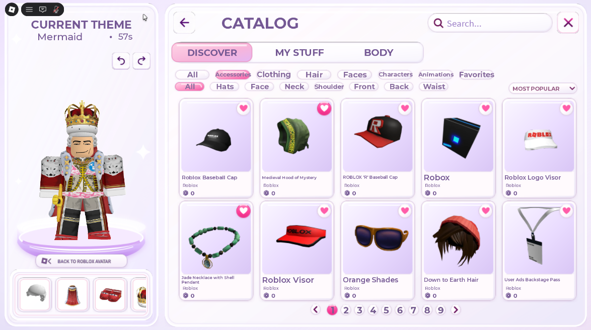
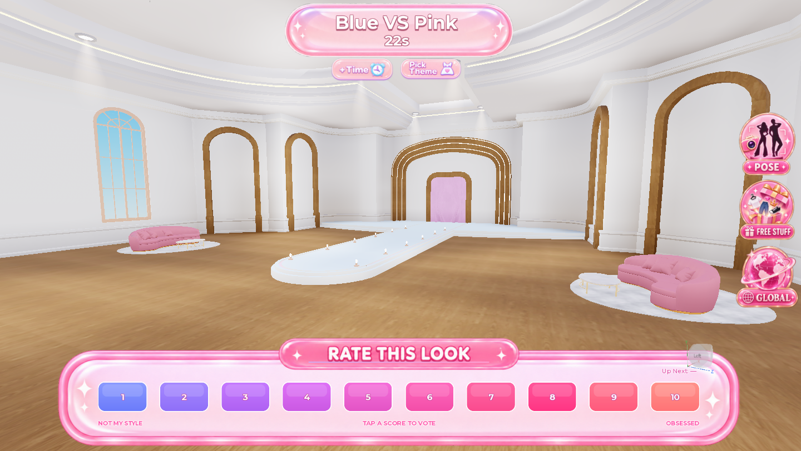
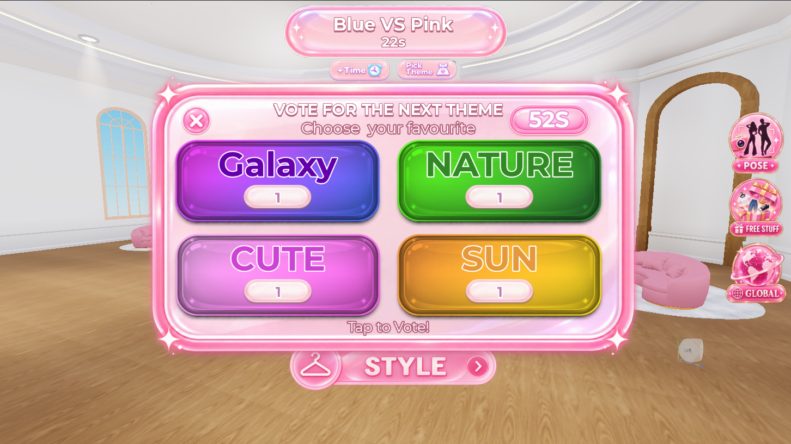
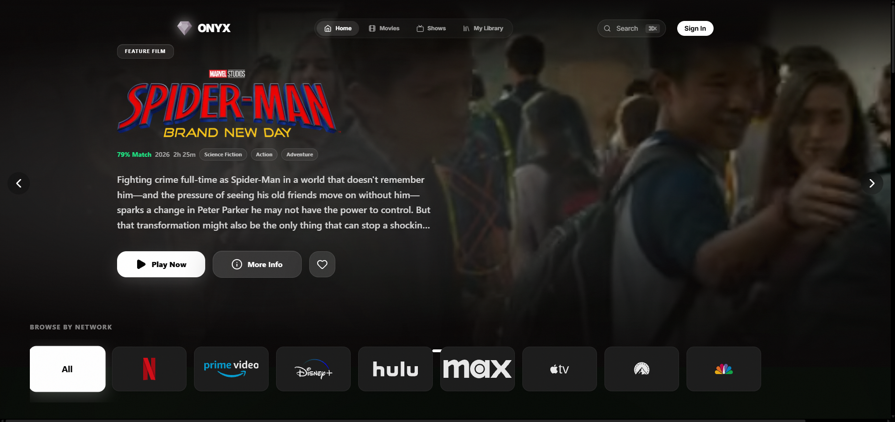
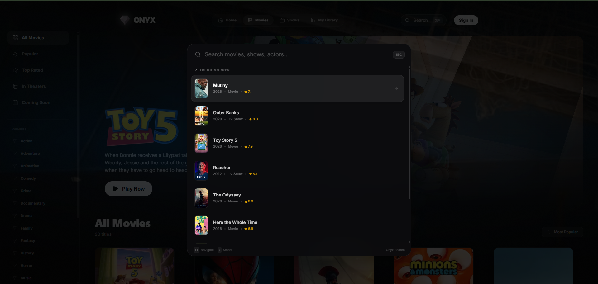
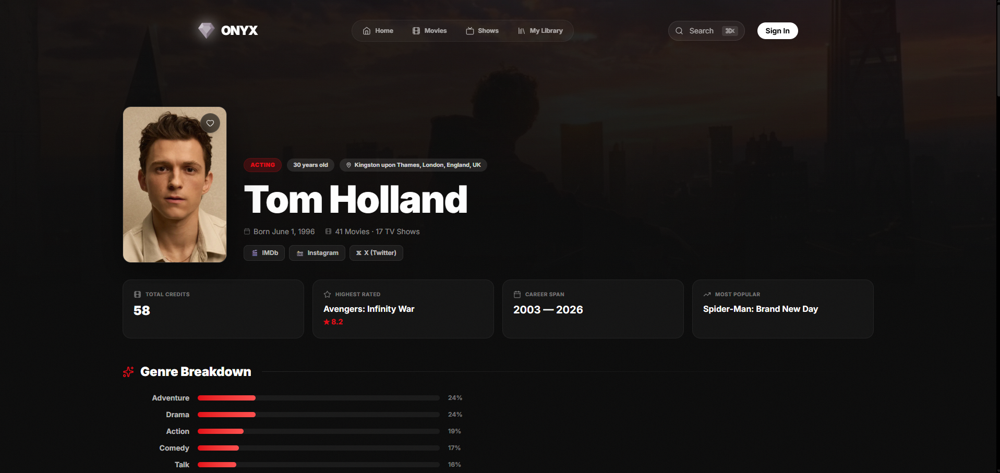

  <a href="#featured-work"><strong>Work</strong></a>
  &nbsp;·&nbsp;
  <a href="#what-i-build"><strong>What I build</strong></a>
  &nbsp;·&nbsp;
  <a href="#toolbox"><strong>Toolbox</strong></a>
  &nbsp;·&nbsp;
  <a href="#github-activity"><strong>Activity</strong></a>
  &nbsp;·&nbsp;
  <a href="https://qwacky899.github.io/Portfolio/"><strong>Portfolio ↗</strong></a>

  
  
  
  

---

## About

I'm **Harry Smith** (`Qwacky899`), a UK-based Roblox developer and product builder working where **engineering, game design and product thinking** meet.

I build complete experiences rather than isolated scripts: gameplay systems, responsive UI, avatar tooling, progression, social features, web products, internal tools and the infrastructure needed to keep all of it maintainable as a project grows.

> **The goal:** technically solid products that feel obvious, fast and polished to the person actually using them.

<table>
  <tr>
    <td width="33%" align="center" valign="top">
      <strong>GAME SYSTEMS</strong> 
      Gameplay architecture, social loops, avatar systems & progression
    </td>
    <td width="33%" align="center" valign="top">
      <strong>PRODUCT / UI</strong> 
      Interaction design, onboarding, retention loops & mobile-first UX
    </td>
    <td width="33%" align="center" valign="top">
      <strong>TOOLS / WEB</strong> 
      Developer tooling, web apps, APIs & workflow automation
    </td>
  </tr>
</table>

## Now

<table>
  <tr>
    <td width="34%" valign="top">
      <strong>STYLE IT</strong> 
      Taking a social fashion game from polished prototype toward a launch-ready product.
    </td>
    <td width="33%" valign="top">
      <strong>RoAgent</strong> 
      Exploring AI-assisted Roblox development, persistent project context and better agent workflows.
    </td>
    <td width="33%" valign="top">
      <strong>Production systems</strong> 
      Building reusable infrastructure that makes future Roblox projects faster to ship and easier to scale.
    </td>
  </tr>
</table>

---

## Featured work

### STYLE IT IN DEVELOPMENT

**STYLE IT** is a social fashion game built around avatar customisation, themed rounds, live voting and outfit discovery. I handle the project across **full-stack Roblox development, systems architecture, UI/UX, product direction and launch strategy**.

  

<table>
  <tr>
    <td width="33%" align="center" valign="top">
      
       <strong>Runway & live voting</strong>
    </td>
    <td width="33%" align="center" valign="top">
      
       <strong>Theme selection</strong>
    </td>
    <td width="33%" align="center" valign="top">
      
       <strong>Global Fits</strong>
    </td>
  </tr>
</table>

The game combines a full avatar catalog and body editor with a fast round loop, player voting, results, theme selection and a social outfit-publishing system.

**Current focus:** shortening the path from join → dress → runway, polishing desktop/mobile UX, and building systems that can support progression, live content and long-term retention.

`Roblox Studio` `Luau` `UI/UX` `Product Design` `Game Systems`

  
<strong>Technical scope</strong>

   
  STYLE IT touches several systems that become difficult once they have to work together: avatar state, catalog data, responsive interfaces, round orchestration, voting, social publishing, persistence and content iteration. A large part of the work is keeping those systems modular while making the player-facing loop feel simple.

 

### ONYX PERSONAL WEB PROJECT

**ONYX** is a cinematic media-discovery interface I built to explore richer web-app UX beyond Roblox — including personalised browsing, search, watch history, actor profiles and content metadata.

  

<table>
  <tr>
    <td width="50%" align="center" valign="top">
      
       <strong>Search & recent activity</strong>
    </td>
    <td width="50%" align="center" valign="top">
      
       <strong>Profiles & metadata</strong>
    </td>
  </tr>
</table>

The project focuses on **information hierarchy, cinematic presentation, responsive navigation and dense data-driven UI** without letting the interface become noisy.

`TypeScript` `React` `API Integration` `UI/UX` `VS Code`

---

## What I build

<table>
  <tr>
    <td width="50%" valign="top">
      <h3>Game systems</h3>
      
Round orchestration, inventories, avatar systems, progression, persistence, social mechanics and reusable service architecture.

    </td>
    <td width="50%" valign="top">
      <h3>UI & product design</h3>
      
Responsive interfaces, onboarding, interaction states, information hierarchy, feedback loops and mobile-first Roblox UX.

    </td>
  </tr>
  <tr>
    <td width="50%" valign="top">
      <h3>Developer tooling</h3>
      
Workflows and tools around source control, Rojo, AI-assisted development, project context and production efficiency.

    </td>
    <td width="50%" valign="top">
      <h3>Prototypes → products</h3>
      
Rapidly testing loops and interfaces, then rebuilding the ideas that work into maintainable systems designed to survive real players.

    </td>
  </tr>
</table>

### Other work

- **Boho Salon** — Roblox development work around fashion and role-play experiences.
- **Systems & prototypes** — gameplay experiments, avatar/inventory architecture, progression loops and internal tooling.
- **Portfolio archive** — scripting, environments, assets, interfaces and development experiments across older work.

  <a href="https://qwacky899.github.io/Portfolio/"><strong>Explore the full portfolio →</strong></a>

---

## Toolbox

### Roblox & design

### Software & web

---

## GitHub activity

  
  

  

### Contributions

<picture>
  <source media="(prefers-color-scheme: dark)" srcset="https://raw.githubusercontent.com/Qwacky899/Qwacky899/output/github-snake-dark.svg" />
  <source media="(prefers-color-scheme: light)" srcset="https://raw.githubusercontent.com/Qwacky899/Qwacky899/output/github-snake.svg" />
  
</picture>

The contribution visual is regenerated automatically by GitHub Actions and adapts to light/dark mode.

---

## Direction

Right now I'm focused on turning individual projects into a stronger **independent Roblox production pipeline**: better architecture, better tooling, faster iteration and products with a clearer reason for players to return.

<table>
  <tr>
    <td width="33%" align="center"><strong>BUILD</strong> systems that hold up</td>
    <td width="33%" align="center"><strong>ITERATE</strong> until the product feels obvious</td>
    <td width="33%" align="center"><strong>SHIP</strong> the ideas worth keeping</td>
  </tr>
</table>

  <a href="https://qwacky899.github.io/Portfolio/">Portfolio</a>
  &nbsp;·&nbsp;
  <a href="https://github.com/Qwacky899?tab=repositories">Repositories</a>
  &nbsp;·&nbsp;
  <a href="https://www.roblox.com/communities/2868558/Boho-Salon#!/about">Roblox</a>

