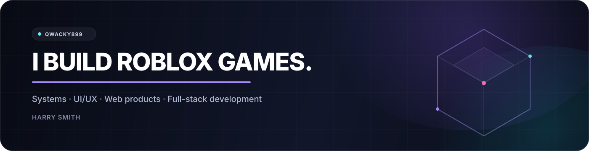

  

  
  

## About

I'm **Harry Smith** (`Qwacky899`), a UK-based Roblox developer focused on building polished games from both the engineering and product side.

I work across **game systems, UI/UX, gameplay design, 3D, web tooling and product strategy** — with most of my current work centred around creating Roblox experiences that feel polished, clear and commercially strong.

## Featured work

### STYLE IT IN DEVELOPMENT

**STYLE IT** is a social fashion game built around avatar customisation, themed rounds, live voting and outfit discovery.

I handle the project across **full-stack Roblox development, systems architecture, UI/UX, product direction and launch strategy**.

<table>
  <tr>
    <td width="50%" align="center" valign="top">
      
       
      <strong>Catalog & avatar customisation</strong>
    </td>
    <td width="50%" align="center" valign="top">
      
       
      <strong>Runway & live voting</strong>
    </td>
  </tr>
  <tr>
    <td width="50%" align="center" valign="top">
      
       
      <strong>Player-driven theme voting</strong>
    </td>
    <td width="50%" align="center" valign="top">
      
       
      <strong>Global Fits & outfit discovery</strong>
    </td>
  </tr>
</table>

The game combines a full avatar catalog and body editor with a fast fashion round loop, player voting, results, theme selection and a social outfit-publishing system.

**Current focus:** improving the speed and clarity of the core loop, polishing desktop and mobile UX, and building systems that can support progression, content updates and long-term retention.

`Roblox Studio` `Luau` `UI/UX` `Product Design` `Game Systems`

---

### ONYX PERSONAL WEB PROJECT

**ONYX** is a cinematic media-discovery interface I built to explore richer web-app UX beyond Roblox — including personalised browsing, search, watch history, actor profiles and content metadata.

  
   
  <strong>Home & content discovery</strong>

<table>
  <tr>
    <td width="50%" align="center" valign="top">
      
       
      <strong>Search & recent activity</strong>
    </td>
    <td width="50%" align="center" valign="top">
      
       
      <strong>Profiles & metadata</strong>
    </td>
  </tr>
</table>

The project focuses on **information hierarchy, cinematic presentation, responsive navigation and dense data-driven UI** while keeping the experience visually restrained.

`TypeScript` `React` `API Integration` `UI/UX` `VS Code`

## Other work

<table>
  <tr>
    <td width="50%" valign="top">
      <h3>Boho Salon</h3>
      
Roblox development work with <strong>Boho Salon Group</strong>, focused around fashion and role-play experiences.

    </td>
    <td width="50%" valign="top">
      <h3>Systems & prototypes</h3>
      
Gameplay systems, avatar and inventory architecture, progression loops, tooling and rapid prototypes used to test new ideas.

    </td>
  </tr>
  <tr>
    <td width="50%" valign="top">
      <h3>UI & product design</h3>
      
Responsive Roblox interfaces, onboarding, interaction states, information architecture and mobile-first design.

    </td>
    <td width="50%" valign="top">
      <h3>Portfolio</h3>
      
A broader archive of scripting, environments, assets, interface work and development experiments.

      
<a href="https://qwacky899.github.io/Portfolio/"><strong>View portfolio →</strong></a>

    </td>
  </tr>
</table>

## Stack

### Game development & design

### Software & web tooling

## Current direction

- Turning **STYLE IT** into a launch-ready Roblox product.
- Building reusable systems and a stronger production pipeline.
- Expanding into web products and tools that support a long-term independent studio.

  <a href="https://qwacky899.github.io/Portfolio/"><strong>Explore more of my work →</strong></a>

